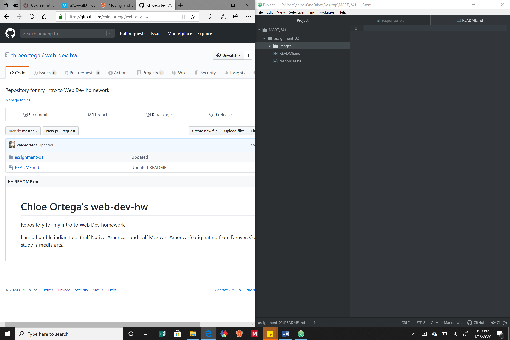

# Assignment 2
## Chloe Ortega

I decided I wanted to take this class because I wanted to begin to understand basic web designing. I went to a technology high school when I lived in Denver, Colorado and coming back to technology after not studying it for many years it’s amazing to see how much has changed. I know that being able to have this in my tool belt as a media artist will help me in my future career. It would be nice to be able to learn the mechanics that go along to web design so I won’t have to be completely reliant on someone outside working on my web pages/website. This will also give me practice at trial and error method because right now I am slightly intimidated by technology. Since this is an online class I don’t feel as much anxiety as if I were to be in a classroom setting and I’m not working as fast as my other peers.

Three things that I have learned and hope to learn are:

- Learned more efficient ways of setting up my directories
- Learned some of the basics of how a text editor works
- I want to continue to learn more about the foundations of web designing so I can continue to build on them

A website that I visit frequently is [YouTube](https://www.youtube.com/)

[My Responses File](./responses.txt)

