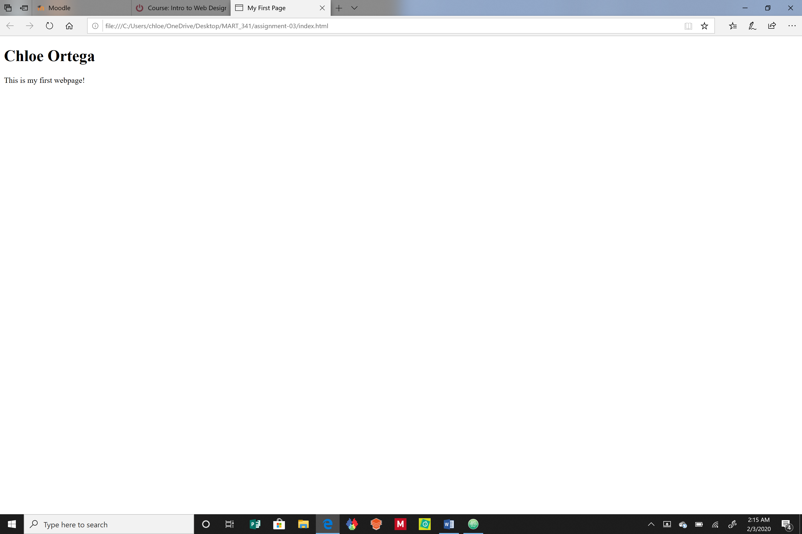

# Assignment 03
## Chloe Ortega

13. Very briefly detail how browsers function. List any browsers you currently use to surf - or even develop for - the web.

    Browsers are a program that functions by a user using its interface to ask for content directed by the browser engine through the network to a server, the content is located then retrieved from the web. The browsers rendering engine and javascript interpreter then deciphers the web language (html and css) to show the content on a page; data storage allows the users page to stay the same even if it is refreshed. There are many types of browsers, depending on the device or it’s usage, I surf on Microsoft Edge, Chrome, Safari, and Firefox.

14.	What is a markup language? Describe one commonly used in development.

    A markup language is a language used to instruct the building of a webpage, one commonly used in development is HTML or HTM. HTML or HTM stands for Hypertext Markup Language, it is the first web language that is commonly used and is utilized for the base and arrangement of content on a page. After the initial foundation is set it can support other features being embedded or attached such as scripts and style sheets

