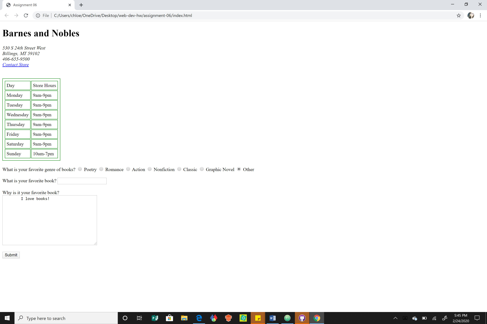

# Assignment 06
## Chloe Ortega

1. Describe any forms you've come across while browsing the web. What purposes do the serve?

I’ve come across forms everyday while browsing the web, some more than others. Each day I see a form when prompted to log into moodle. I see them when I use google, youtube, booking, seatgeek, target, and torrid websites. I use online shopping a lot as I live in the sticks so I see them when I am ordering items, they serve to understand what I want, the amount, and my shipping information. I’ve also seen them when I’ve applied for scholarship or financial aid, the purpose for these is to gather my information so the people in charge can assess whether I should get funding for school. Each form I’ve come across serves to help my interaction with websites to make it simple and more efficient.

2. List examples of a text, selection, and button input, and where they might be used.

Text, selection and button input are used in a variety of places all the get our information and send it to another server to possibly get back information. Text inputs can include a text box requesting information for example your date of birth, name, or password, these could be helpful when making an account with a company. Selection inputs can include a question where the answer is given as a set choice for example have you ever been to a library, the answer would be given by selecting either yes or no. Button inputs give functionality and visual interest to a form, an example of this would be a submit button after you filled out information or an upload button where you can upload a file such as an mp3.

3. Free Response: Summarize your work cycle for this assignment.

This week I started with going over the Intro-Web-Dev website Forms module and taking notes. I spent more time on the w3schools website going over tutorial, it helps to have a place on the web where I can manipulate code and see the outcome. I reread sections in the HTML & CSS book so I could start piecing the sections together. I went surfing on the web and visited websites where I knew I had seen forms before and that helped me with my assignment question for the week. This week an issue I came across was getting overwhelmed with growing code, to solve this problem I collapsed sections and focused on one at a time.

