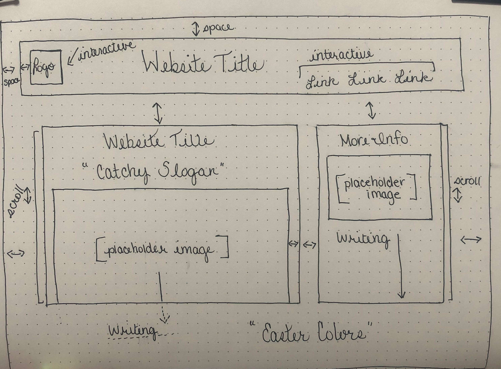

# Assignment 11
## Chloe Ortega

1.	What is the difference between padding, margin, and borders?

Padding designates space between content and the border around it, margin designates space between where the boxes content is and outside the padding and border. Borders designates the space around the content and padding.

2.	Embed the image of your sketch.

3.	Free Response: Summarize your work cycle for this assignment.

This week I started off going over the material from the Intro-Web-Dev website and HTML & CSS book. After going over the assignment parameters I researched website designs and layouts. I decided to design a simple website layout that would help me get comfortable manipulating the code for my desired outcome for more advanced layouts. I had a few minute problems, my content was not displaying how I wanted it too. To solve this problem, I made another container for that information and was able to place it where I wanted. A problem that I have yet to solve is, my interactive links move my right boxes content and I’m unsure where the link is that is doing that. Next time I plan to reach out to the instructor or try to use the issues form to get some insight.
